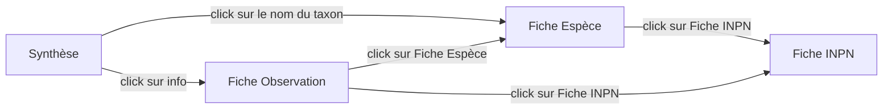

#

```mermaid
graph LR
S[Synthèse] -- click sur le nom du taxon --> E[Fiche Espèce]
S[Synthèse] -- click sur info --> O[Fiche Observation]
O[Fiche Observation] -- click sur Fiche Espèce --> E[Fiche Espèce]
E[Fiche Espèce] -- click sur Fiche INPN --> I[Fiche INPN]
O[Fiche Observation] -- click sur Fiche INPN --> I[Fiche INPN]
```