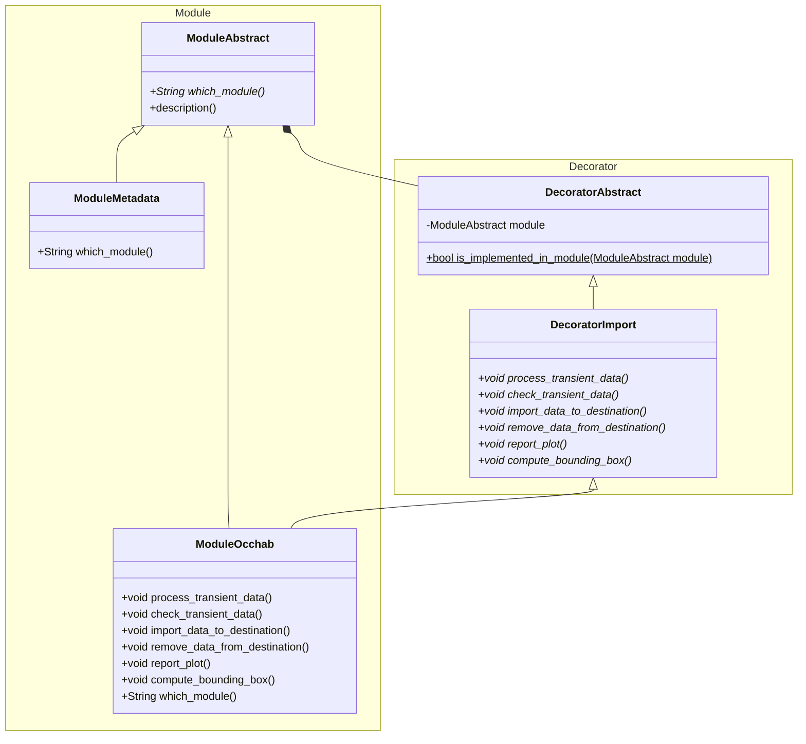

#
J'ai fait une petite démo de ce à quoi ça pourrait ressembler.

> :warning: Attention, il y a deux utilisation du mots Decorator différentes.
> - Pattern Decorator
> - Python Decorator

On utilise le _décorateur_ python `@abstractclass` du module ABC pour forcer la définition des méthodes, etc.

On utilise le pattern _décorateur_  pour ajouter des fonctionnalités et des méthodes à définir à un module.

La méthode `which_module` de `ModuleAbstract` permet de vérifier que l'héritage côté Module se passe bien.

La méthode `description` de `ModuleAbstract` permet de génerer une description indiquant si le module implémente l'import ou non.
Elle s'appuit sur la mathode statique `is_implemented_in_module` de `DecoratorAbstract`, qui permet de savoir si un module passé en paramètre est une instance du Décorateur courant
Potentiellement un mauvais design d'avoir cette méthode ici. Un parent conscient de ses enfants.
On voudrait surement l'avoir dans une méthode séparée, un manager de module ou quelque chose comme ça.

Diagramme de ce qu'il se passe dans le code.
> J'ai retiré "ModuleSynthese" pour plus de lisibilité. Cette classe est la soeur de ModuleOcchab, et se comporte exactement de la même manière.

