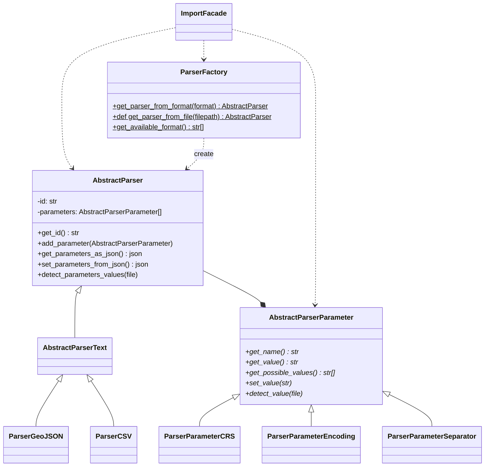
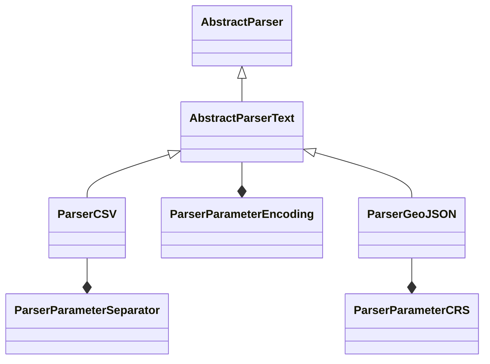

# Parser

2 options

- normalisation
- parser

## Approche "normalisation"

Convertir le fichier en fichier CSV.

```mermaid
flowchart LR
UF[Upload@Frontend] -- fichier --> UB[Upload@Backend]
UB --> DdF{Detection du format}
DdF -- CSV --> DP[Vérification\nDétection Paramètres CSV]
DP --> N((Format CSV))
N -- paramètres initiaux --> DF[Decode@Frontend]
DF -- paramètres ajustés --> DB[Decode@Backend]
DdF -- GEOJSON --> C[Normalization]
C --> N((Format CSV))
```

### Pour

- Très peu de développement.

### Contre

- Faiblement adapté à l'intégration de nouveau formats
- Les paramètres choisit à la conversion (séparateur, etc.) présents côté utilisateur: source d'erreur, confus (geojson --> séparateur?)
- Pas de paramètres supplémentaires

## Approche "parser"

### CSV vs pandas

Actuellement, le module d'import est dépendant au format de csv de source_file à différents endroits:

- route upload: détection d'erreur //
- route decode: détection d'erreur //
- route load: *insert_import_data_in_transient_table* // parse the file

- route source_file: *get_import_source_file* // mime_type
- route invalid_rows: *get_import_invalid_rows_as_csv* // parse the original file

On remarque que le format des données d'entrée impacte seulement l'interaction avec l'avant procédé et l'après procédé.
Le processus d'import à proprement parler s'appuit sur une **transient_table**.

On utilise le fichier source au format CSV pour:

- charger les données dans la transient_table
- récupérer les données qui posent problèmes
- récupérer le fichier source

Ces étapes ne représentent pas de problèmes particuliers aujourd'hui (perf, compréhension, etc.) --> **pourquoi vouloir introduire un dataframe ?**

Ces étapes qui sont de la gestion d'Entrée/Sortie devraient être couverte naturellement par l'approche par parser.

### Données tabulaires

Les données d'entrée sont globalement gérées dans l'import avec une approche très orientée tableau.
On parle de **lignes**, de **column**, de **ligne en erreur**, de **numéro de ligne**, etc.
Les erreurs sont également identifiées par un numéro de ligne, etc.

Cette approche tabulaire ne convient pas par exemple à un structure de données geojson.

Plusieurs solution peuvent être envisagée. A ce jour, aucune n'est complètement satisfaisante.

#### Modification de cette approche

On peut envisager de modifier cette approche. **column** deviendrait **champs**, **line_no** deviendrait **entité importée** (terminologie à revoir), etc.

#### Fit de cette approche

Une solution pas trop invasive à ce problème pourrait être de juxtaposer les deux fichiers si besoins:

- le fichier source
- le fichier source au format csv

Cette solution permettrait:

- de continuer à traiter les références aux données, dont les erreurs, avec des indications tabulaires (line_no)
- de permettre à l'utilisateur de consulter la version tabulaire, pour retrouver les données en erreur.

Par exemple, pour traiter la demande des lignes en erreurs, gn s'appuirait sur le système actuel.

### Abstract Parser et Abtsract Parser Parameters

L'enjeux principal à mon sens réside dans **la gestion des paramètres de parsing**.

```mermaid
flowchart LR
UF[Upload@Frontend] -- fichier --> UB[Upload@Backend]
UB -- Detection Parser --> P[Parser ok]
P -- Verifications --> FV[Fichier ok]
FV -- Détection --> PD[Paramètres détectés]
PD -- paramètres initiaux --> DF[Decode@Frontend]
DF -- paramètres ajustés --> DB[Decode@Backend]
```

Quelques remarques:

- Cette section est agnostique de CSV, DataFrame, etc.
- Gestion des paramètres côté frontend: un mécanisme similaire au mapping des champs (menu déroulant)
- Détection des valeurs par défault: paramètre OU parser. A définir.



> Parser + Parameters


